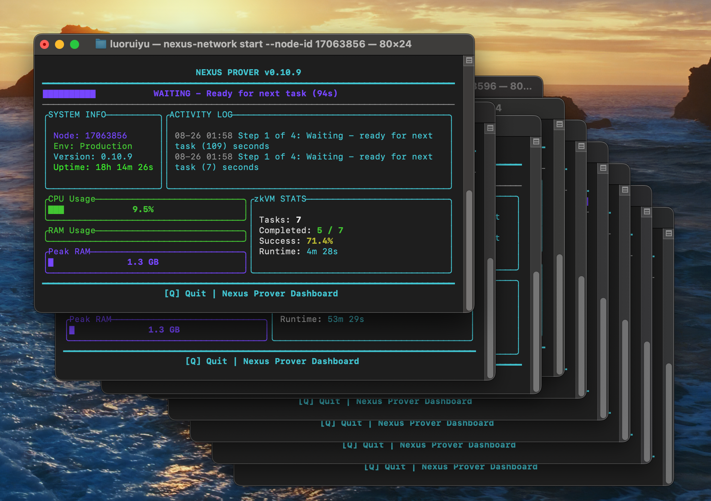
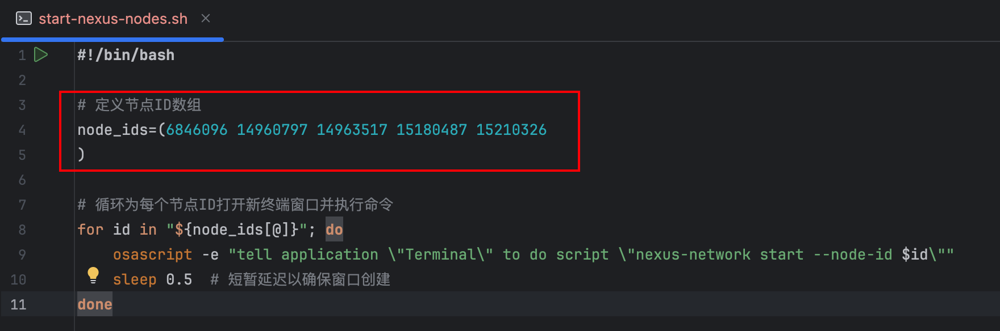
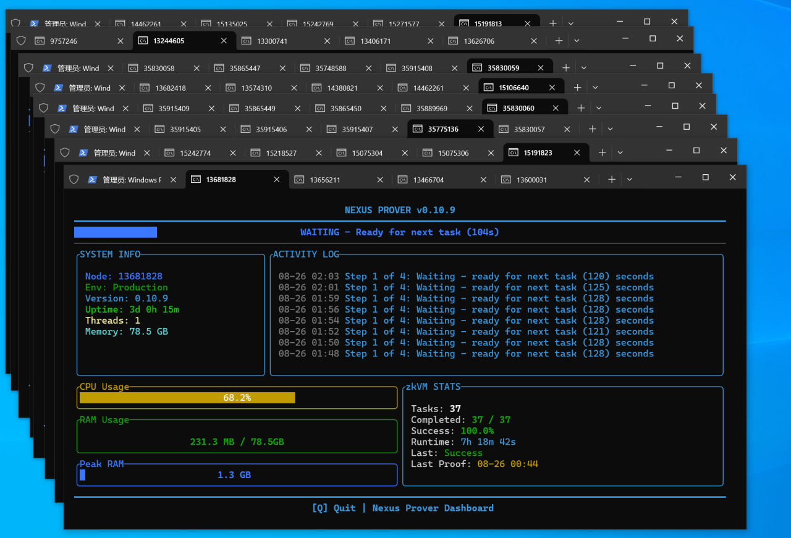
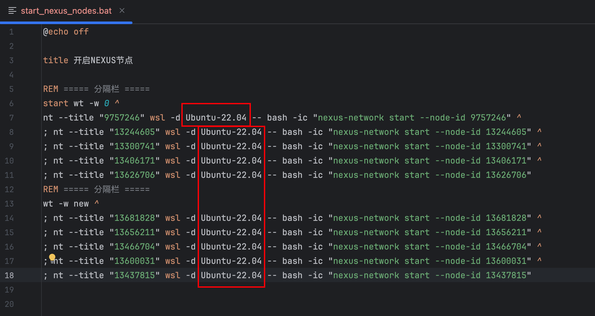

# nexus-script
## 用于多开nexus-cli的脚本

### 一、适用于Mac的脚本（位于script1文件夹内）

​	1.程序运行如图：



​	2.位于script1文件夹下，可在此处填入自己的NodeId

​	3.然后在终端使用如下命令启动所有节点（需先进入脚本文件所在目录）：

```
./start-nexus-nodes.sh
```

​	4.需要关闭时可在终端使用如下命令关闭所有窗口（需先进入脚本文件所在目录）：

```
./stop-nexus-nodes.sh
```

------


### 二、适用于Windows的脚本（位于script2文件夹内）

​	1.程序运行如图：



​	2.需要预先安装WSL，我安装的是Ubuntu-22.04，安装其他版本的需要修改下面bat文件截图中框起的Ubuntu-22.04为你自己下载的版本，同时需要安装终端预览（Windows Terminal Preview）（可以从微软商店下载）

